# 网络安全第一次实验
## 基于 VirtualBox 的网络攻防基础环境搭建

---

### 实验目的
1. 掌握 VirtualBox 虚拟机的安装与使用；
2. 掌握 VirtualBox 的虚拟网络类型和按需配置；
3. 掌握 VirtualBox 的虚拟硬盘多重加载；

---

### 实验环境
以下是本次实验需要使用的网络节点说明和主要软件举例：
- VirtualBox 虚拟机
- 攻击者主机（Attacker）：Kali Rolling (2021.2) x64
  - Attacker 
- 网关（Gateway, GW）：Debian Buster
  - Gateway
- 靶机（Victim）：From Sqli to shell / xp-sp3 / Kali
  - Victim-XP-1
  - Victim-XP-2
  - Victim-Debian-2
---

### 实验步骤

#### 1. 下载镜像，下载老师提供的镜像文件
---
#### 2.将镜像修改为多重加载

将老师提供的 `Debian 10` 和 `Windows XP SP3` vdi文件修改为多重加载模式

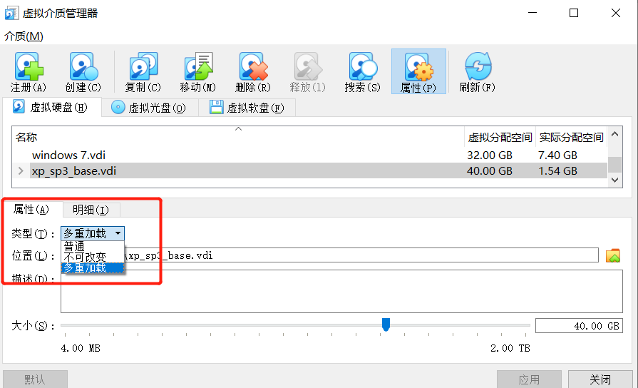

**修改方法：**

点击virtualbox左上方的管理，选择虚拟介质管理，在弹出的窗口上点击左上方的注册，选择需要的vdi文件，然后点击类型右面的小黑三角，选择多重加载

修改之后就是这样
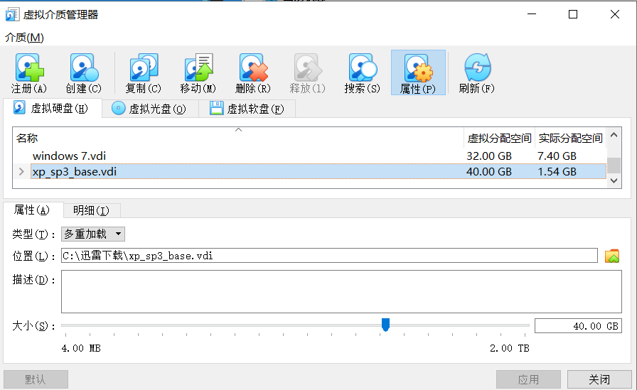

---

#### 2. 配置网络
---
##### `网关`配置

所需要的网卡：NAT网络（使得网关可以访问攻击者主机）、Host-only网络、两块内部网卡（分别用于搭建两个独立的局域网）
---
如图：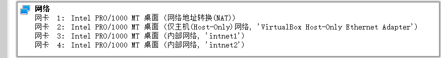

##### `攻击者主机`配置

NAT网络

如图：
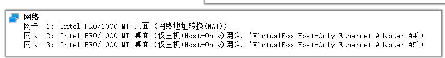

使用ip a命令查看攻击者主机的ip,结果如图
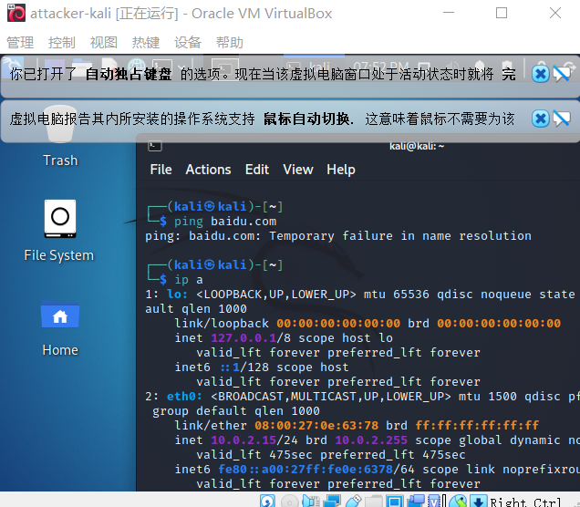
攻击者主机的ip地址：10.0.2.15

##### 被攻击者网卡配置
如图：
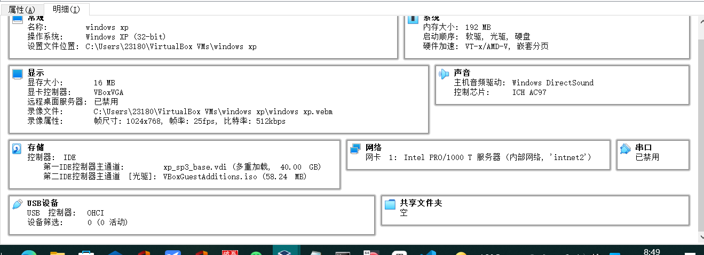

使用ipconfig命令查看靶机ip

靶机的ip地址：172.16.222.130

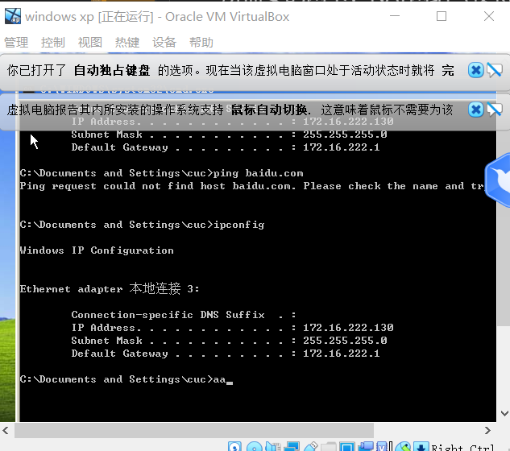

### 实验验证

1.在靶机里ping攻击者主机的ip，发现可以ping通，说明靶机可以直接访问攻击者主机

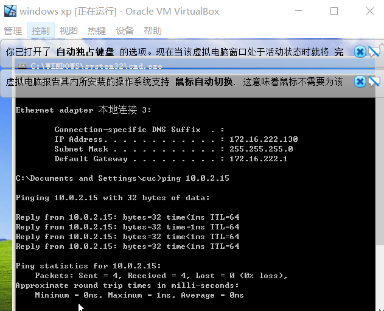

2.在攻击者主机里ping靶机的ip，发现无法ping通，说明攻击者主机不能直接访问靶机

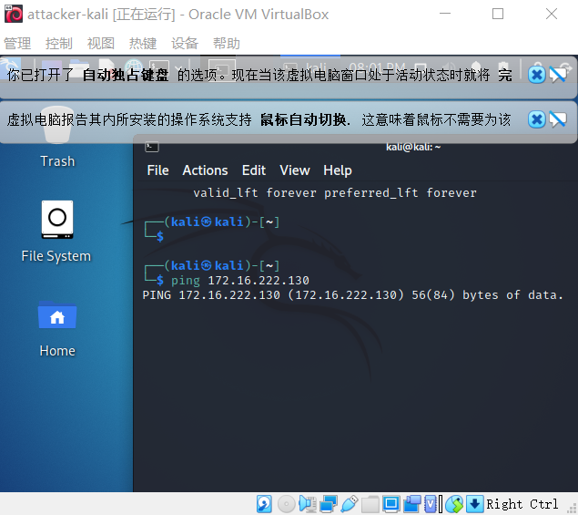

3.网关可以直接访问攻击者主机和靶机

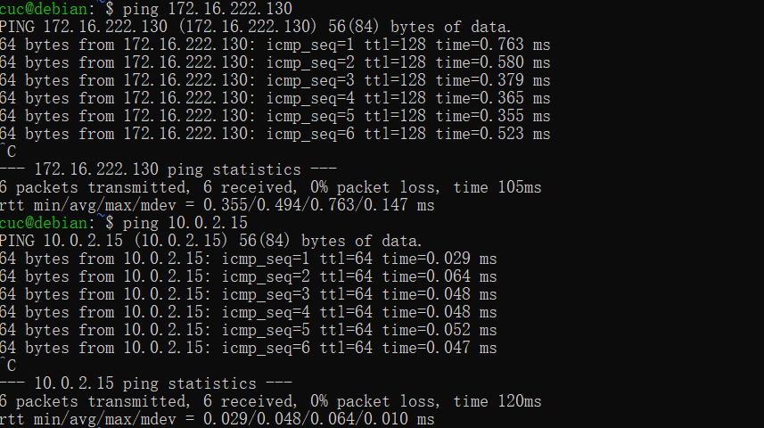

4.靶机的所有上下行流量必须经过网关
在网关中输入命令：sudo tail -F /var/log/dnsmasq.log

可以获取DNS记录

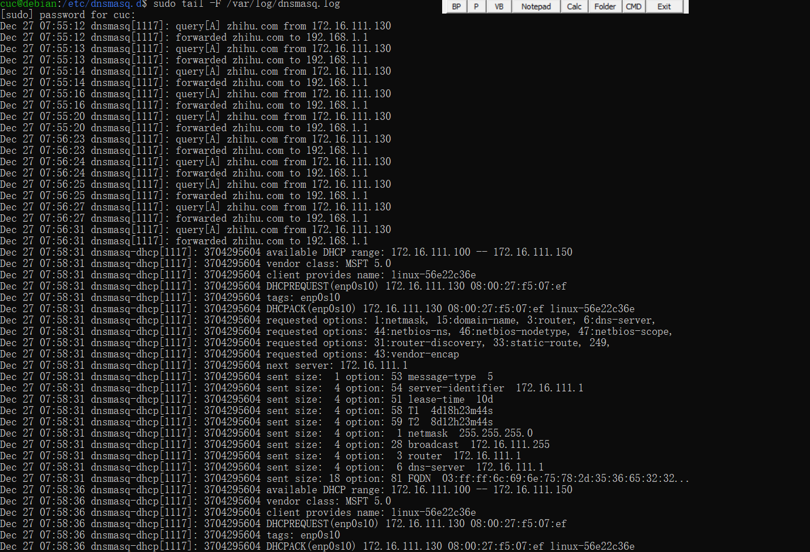

分析DNS记录可以得知靶机的所有上下行流量都必须经过网关

### 实验要求

- 搭建满足如下拓扑图所示的虚拟机网络拓扑；

**完成以下网络连通性测试**；
- [x] 靶机可以直接访问攻击者主机
- [x] 攻击者主机无法直接访问靶机
- [x] 网关可以直接访问攻击者主机和靶机
- [x] 靶机的所有对外上下行流量必须经过网关
- [x] 所有节点均可以访问互联网

---

